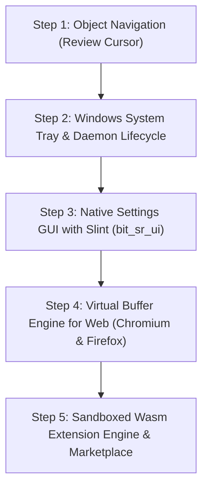

# `bit_sr` Technical Roadmap & Execution Plan

This document outlines the architectural milestones, completed foundations, and the **next 5 priority implementation steps** for the `bit_sr` native screen reader project.

---

## 1. Project Status Overview

| Subsystem | Status | Key Highlights |
| :--- | :--- | :--- |
| **`bit_sr_core`** | **Stable** | 100% platform-agnostic, Android-inspired tree, universal key/gesture models, 5-language localization catalogs (en, hi, es, fr, de), `#![forbid(unsafe_code)]`. |
| **`bit_sr_platform_windows`** | **Active** | Sub-50ns `WH_KEYBOARD_LL` input hook with dedicated decoding worker, UIA MTA client with sub-100ns event callbacks & focus coalescing, MSAA WinEvent hook, File Explorer heuristics, text/caret provider with blank detection and line extraction. |
| **`bit_sr_speech`** | **Active** | Dedicated async SAPI 5 worker thread with non-destructive queue management, instant keystroke interruption (`SPF_PURGEBEFORESPEAK`), `SpeechHub` abstraction. |
| **`bit_sr_engine`** | **Active** | Main coordinator loop, `FocusTracker` anti-chatter deduplication, `SpeechFormatter` localized template formatting, caret navigation & typing echo. |
| **GUI Framework** | **Decided** | **Slint** selected after empirical accessibility benchmarking with AccessKit. |

---

## 2. Next 5 Priority Implementation Steps

---

### Step 1: Object Navigation & Screen Review (Review Cursor)
**Objective:** Allow users to explore any application's visual layout and accessibility tree without moving keyboard focus.

* **Tree Walker Navigation:**
  - Leverage `IUIAutomationTreeWalker` (`ControlViewWalker` and `RawViewWalker`) in `bit_sr_platform_windows::uia::TreeNavigator`.
  - Maintain an active `ReviewCursor` in `bit_sr_engine` tracking the currently inspected node.
* **Standard Screen Reader Review Shortcuts:**
  - `SR + Left Arrow`: Move to previous sibling element in tree.
  - `SR + Right Arrow`: Move to next sibling element in tree.
  - `SR + Up Arrow`: Move up to parent container.
  - `SR + Down Arrow`: Move down to first child element.
  - `SR + Enter`: Perform default action (invoke / click / expand) on current review element.
  - `SR + Numpad 5` / `SR + Dot`: Re-read current review element details.
* **Heuristics:** Clamp navigation within top-level window boundaries to enforce Invariant 3 (focus-anchored queries).

---

### Step 2: System Tray & Background Daemon Lifecycle
**Objective:** Transform `bit_sr` into a real, persistent background service that lives in the notification area.

* **Win32 System Tray Icon (`Shell_NotifyIconW`):**
  - Display tray icon with `bit_sr` status.
  - Context menu on right-click:
    - *Settings...* (opens GUI dashboard)
    - *Speech Mode* (Talk / Mute)
    - *View Logs*
    - *Exit bit_sr*
* **Windowless Background Process:**
  - Configure `windows_subsystem = "windows"` in release builds to eliminate the command prompt window.
* **Single-Instance Enforcement:**
  - Implement a named Win32 Mutex (`Global\bit_sr_single_instance_lock`) to prevent accidental duplicate launches.

---

### Step 3: Accessible Native Settings GUI (`bit_sr_ui` powered by Slint)
**Objective:** Provide an accessible, modern, native settings dashboard for synthesizer selection, speech parameters, and keyboard configuration.

* **Create Workspace Crate:** `crates/bit_sr_ui` using **Slint** (with native AccessKit integration).
* **Configuration Storage:**
  - Persist settings in `%APPDATA%\bit_sr\config.toml` (or JSON).
  - Configurable settings:
    - Voice selection (enumerates installed SAPI 5 / OneCore voices).
    - Speech rate, volume, and pitch sliders.
    - Typing echo mode (Characters, Words, Characters & Words, None).
    - Screen reader modifier key (CapsLock, Insert, or Both).
    - Language / UI locale selector.
* **Launch Trigger:**
  - Hotkey `SR + N` or clicking *Settings...* in the system tray.

---

### Step 4: Virtual Buffer Engine for Web & Documents
**Objective:** Flatten complex web pages (Chromium, Firefox) and Electron apps (VS Code, Slack, Discord) into a seamless, linear reading buffer.

* **Virtual Buffer Architecture:**
  - Flatten UIA/IA2 document subtree into an internal navigable text stream (`browse mode`).
  - Distinguish between **Browse Mode** (reading text) and **Focus Mode** (typing into form inputs).
  - Automatic focus mode switching on `Enter`/`Space` inside text inputs and combo boxes.
* **Quick Navigation Keys (in Browse Mode):**
  - `H` / `Shift + H`: Next / previous Heading (and `1`-`6` for specific heading levels).
  - `K` / `Shift + K`: Next / previous Link.
  - `F` / `Shift + F`: Next / previous Form field / Edit control.
  - `B` / `Shift + B`: Next / previous Button.
  - `T` / `Shift + T`: Next / previous Table.
  - `L` / `Shift + L`: Next / previous List.

---

### Step 5: Sandboxed WebAssembly (Wasm) Extension Engine & Marketplace
**Objective:** Implement the plugin ecosystem using `wasmtime` with strict capability-based security.

* **Wasm Host Runtime (`bit_sr_plugin`):**
  - Integrate `wasmtime` with WebAssembly Component Model.
  - Capability manifests:
    - `speech:synthesizer`: Register custom synthesizer drivers (e.g., OpenEVB or eSpeak NG compiled to Wasm).
    - `speech:filter`: Read and transform outgoing speech text.
    - `hotkey:register`: Define custom key combinations.
    - `accessibility:inspect`: Read properties of focused/inspected elements.
* **Marketplace / Add-on Manager:**
  - Add-on discovery tab in the Slint GUI dashboard.
  - One-click install, enable, disable, and sandbox permission inspection.

---

## 3. Future Roadmap (Beyond Step 5)

* **Phase 6: Linux Desktop AT-SPI2 D-Bus & Wayland Integration (`bit_sr_platform_linux`)**
  - Pure Rust `atspi` / `zbus` event loop.
  - Wayland input capture protocols & evdev.
  - Speech Dispatcher (`speechd`) integration.
* **Phase 7: Hardware Braille Display Support**
  - Driver abstraction for Focus, Brailliant, Orbit, and HumanWare braille displays via USB / Bluetooth.
  - Liblouis translation integration for contracted and uncontracted Braille.
* **Phase 8: Mobile Android Subsystem (`bit_sr_platform_android`)**
  - Thin Kotlin `AccessibilityService` APK loading native `libbit_sr.so` via JNI.
  - Native touch gesture mapping (Flick Right/Left, Double Tap) dispatched into unified `ScreenReaderCommand`.
  - Accessible Slint settings dashboard using official `accesskit_android` backend.
  - Ahead-of-Time (AOT) `.cwasm` compilation for `bit_sr_plugin` bypassing mobile SELinux JIT restrictions.
  - Android `TextToSpeech` JNI synthesizer driver & AAudio audio hub.
