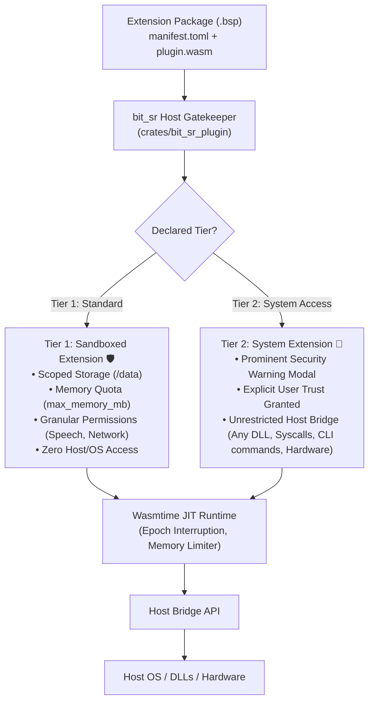

# `bit_sr` WebAssembly Extension Ecosystem Specification

**Document:** `VISION_WASM_EXTENSION.md`  
**Status:** Architecture Blueprint & Consensus  
**Component:** `crates/bit_sr_plugin`  
**Primary Engine:** **Wasmtime** (Bytecode Alliance, 100% Pure Rust, Cranelift JIT)

---

## 1. Executive Summary & Core Philosophy

For decades, the screen reader ecosystem has been trapped between two extremes:
1. **NVDA's Unconstrained Python Model:** All add-ons run with full user privileges in plain-text Python. An add-on can silently install malware, access password managers, leak private documents, corrupt memory, or enter infinite loops that completely freeze the screen reader and silence speech for the blind user. Furthermore, GPL licensing forces proprietary vendors to avoid the ecosystem.
2. **JAWS's Closed Proprietary Model:** Rigid, legacy scripting with no modern language support, vendor lock-in, and limited community extensibility.

`bit_sr` introduces a third, modern path: **An Android-inspired, Capability-Based Extension Ecosystem built on 100% Unified WebAssembly (Wasmtime).**



---

## 2. Architectural Invariants

* **Invariant 1: 100% Unified WebAssembly Runtime**  
  Every extension is packaged and distributed as a compiled WebAssembly component (`plugin.wasm`). There is no separate native DLL plugin loader. All extensions share the exact same Wasmtime execution engine.
* **Invariant 2: Crash Isolation & Speech Continuity**  
  No extension crash, panic, out-of-bounds memory access, or infinite loop can ever terminate the `bit_sr` core process or silence speech.
* **Invariant 3: Transparent User Consent**  
  Sensitive permissions and full system access require explicit user approval via accessible native dialogs in the Slint GUI. Permissions can be revoked at any time by the user.
* **Invariant 4: Dual License Freedom (MIT / Apache-2.0)**  
  Extensions are not forced into viral copyleft licenses. Developers and commercial vendors can release open-source or proprietary extensions freely.

---

## 3. Extension Package Architecture (`.bsp`)

Extensions are distributed as single compressed archives with the `.bsp` (**B**it **S**creen-reader **P**ackage) extension:

```
my_extension.bsp (ZIP archive)
├── manifest.toml        # Extension metadata, permissions & resource limits
├── plugin.wasm          # Compiled WebAssembly binary
└── assets/              # Optional static assets (sound cues, dictionaries, icons)
```

### The Manifest Specification (`manifest.toml`)

```toml
[plugin]
id = "org.bitsr.quick_notes"
name = "Quick Notes"
version = "1.2.0"
author = "Accessibility Devs"
description = "Quickly take and speak accessible notes anywhere."
min_bit_sr_version = "0.1.0"

# Resource quotas enforced natively by Wasmtime & the host
[resources]
max_memory_mb = 64      # Maximum RAM allocation limit
max_storage_mb = 25     # Maximum disk space inside /data

# Granular capabilities (Tier 1)
[permissions]
storage = true          # Access to scoped /data directory
speech = { output = true, filter = false }
network = { access = true, allowed_domains = ["api.notesync.com"] }
hotkeys = ["SR + Shift + N"]

# System Access Capability (Tier 2 - Unlocks full OS control)
# Set to false or omitted for Tier 1 standard extensions.
system_access = false
```

---

## 4. Scoped Storage Model (High-Speed & Practical)

Rather than introducing complex, slow encrypted virtual disk drivers, `bit_sr` uses **Standard WASI Directory Virtualization**:

### A. The Developer Experience
Inside the extension, developers use standard, idiomatic file APIs:
```rust
// Standard Rust inside Wasm (or C/C++/Zig/Go/Python)
let mut file = std::fs::File::create("/data/notes.txt")?;
file.write_all(b"Meeting at 3 PM")?;
```
The extension only sees the virtual path `/data`. It has no knowledge of host paths, drive letters, or system files.

### B. The Host Mount & Zero-Overhead Execution
* On Windows, `/data` maps directly to:  
  `%APPDATA%\bit_sr\extensions\data\<plugin_id>\`
* On Linux, `/data` maps directly to:  
  `~/.local/share/bit_sr/extensions/data/<plugin_id>/`
* **Performance:** File I/O executes at **full native SSD speed** through the OS kernel with **zero encryption/decryption overhead**.
* **Sandbox Enforcement:** Wasmtime’s WASI layer automatically blocks directory traversal attempts (`../../`). The extension cannot escape its designated folder.
* **Storage Quota:** The host checks directory size before writes. If `current_size + write_size > max_storage_mb`, the write fails with `StorageQuotaExceeded`.

---

## 5. Resource Quotas & Fault Tolerance

### A. RAM Quota Enforcement via Wasmtime `ResourceLimiter`
Wasmtime includes native hardware-level memory clamping. In `bit_sr_plugin`:

```rust
use wasmtime::ResourceLimiter;

pub struct ExtensionMemoryLimiter {
    pub max_bytes: usize,
}

impl ResourceLimiter for ExtensionMemoryLimiter {
    fn memory_growing(
        &mut self,
        _current: usize,
        desired: usize,
        _maximum: Option<usize>,
    ) -> Result<bool, wasmtime::Error> {
        if desired > self.max_bytes {
            log::warn!("Extension attempted to exceed declared RAM limit");
            return Ok(false); // Memory growth rejected cleanly
        }
        Ok(true)
    }
}
```
If an extension leaks memory or attempts to allocate 500 MB when it declared 64 MB, allocations cleanly return `OutOfMemory` inside the sandbox without starving the operating system.

### B. Anti-Freeze Epoch Interruption
In NVDA, an infinite loop in an add-on completely hangs the screen reader.  
In `bit_sr`, Wasmtime's **Epoch Interruption** sets strict execution deadlines (e.g. 500ms max for an event callback). If an extension freezes:
1. Wasmtime triggers an epoch trap and halts the extension.
2. The core coordinator catches the trap and logs the failure.
3. The screen reader speaks: *"Extension X timed out and was temporarily paused."*
4. `bit_sr` continues functioning without interruption.

---

## 6. The Two-Tier Permission System

`bit_sr` categorizes extensions into two clear tiers based on their system requirements:

```
┌─────────────────────────────────────────────────────────────────────────────┐
│                             Extension Store                                 │
└───────────────────────┬─────────────────────────────┬───────────────────────┘
                        │                             │
                        ▼                             ▼
       ┌─────────────────────────────────┐   ┌────────────────────────────────┐
       │     Tier 1: Standard Sandbox    │   │      Tier 2: System Access     │
       │       (Shield Icon: 🛡️)         │   │         (Key Icon: 🔑)         │
       ├─────────────────────────────────┤   ├────────────────────────────────┤
       │ • 100% Platform-Independent     │   │ • Full Unrestricted OS Access  │
       │ • Windows & Linux identical     │   │ • Can load ANY native DLL      │
       │ • Scoped storage (/data) only   │   │ • Can execute system commands  │
       │ • Granular permissions          │   │ • Direct hardware / USB access │
       │ • Safe for general users        │   │ • Requires explicit user trust │
       └─────────────────────────────────┘   └────────────────────────────────┘
```

### Tier 1: Standard Sandboxed Extensions (Default)
* **Goal:** Maximum portability and security.
* **Capabilities Available:**
  - `storage`: Scoped read/write in `/data`.
  - `speech:output`: Speak speech strings or play audio sound cues.
  - `speech:filter`: Inspect and transform outgoing speech text (e.g. emoji expansions, pronunciation dictionaries).
  - `accessibility:node:read`: Read focused element role, name, states, and values.
  - `accessibility:tree:walk`: Walk sibling/parent/child trees.
  - `accessibility:interact`: Perform standard actions (click, toggle, invoke).
  - `network:fetch`: Make outbound HTTPS requests (with domain scoping).
  - `input:hotkey`: Register custom keyboard shortcuts.
* **Display in Slint UI:** Displayed with a **Green Shield 🛡️**. Users can install with one click.

---

### Tier 2: System Access Extensions (`system_access = true`)
* **Goal:** Absolute freedom for power tools, hardware braille displays, low-latency audio drivers, and legacy platform integration.
* **Philosophy:** **Do not micromanage or restrict DLLs.** Once the user grants system access, the extension is trusted with full control over the operating system through the host bridge.
* **Capabilities Unlocked:**
  - **Arbitrary DLL & Shared Library Loading:** Can load any Win32 DLL (`user32.dll`, vendor braille drivers like `ftd2xx.dll`, ASIO audio DLLs) or Linux shared object (`.so`).
  - **System Command Execution:** Can spawn background processes, run CLI commands, and interact with the shell.
  - **Raw Hardware Communication:** Direct communication with serial COM ports, USB HID devices, and Bluetooth controllers.
  - **Native OS Syscalls:** Invoke low-level operating system APIs directly via the host bridge.

---

## 7. The Host Gatekeeper & System Bridge

Even for Tier 2 extensions, the code remains compiled WebAssembly. System calls flow through the **Host Gatekeeper** in `bit_sr_plugin`:

```rust
// In crates/bit_sr_plugin/src/host_bridge.rs

pub struct PluginContext {
    pub id: String,
    pub has_system_access: bool,
    pub storage_dir: PathBuf,
}

// Host API for dynamic library loading
pub fn host_sys_load_library(
    caller: &mut Caller<'_, PluginContext>,
    lib_path: String,
) -> Result<u64, HostBridgeError> {
    let ctx = caller.data();

    // The Hard Guard: Check user-granted system permission
    if !ctx.has_system_access {
        log::error!("Extension '{}' attempted unauthorized DLL load: {}", ctx.id, lib_path);
        return Err(HostBridgeError::PermissionDenied);
    }

    // Unrestricted: load the requested library on behalf of the Wasm module
    let lib = unsafe { libloading::Library::new(&lib_path) }
        .map_err(|e| HostBridgeError::LoadFailed(e.to_string()))?;

    let handle = register_loaded_library(lib);
    Ok(handle)
}

// Host API for executing system commands
pub fn host_sys_execute_command(
    caller: &mut Caller<'_, PluginContext>,
    command: String,
    args: Vec<String>,
) -> Result<CommandOutput, HostBridgeError> {
    let ctx = caller.data();

    if !ctx.has_system_access {
        return Err(HostBridgeError::PermissionDenied);
    }

    let output = std::process::Command::new(&command)
        .args(&args)
        .output()
        .map_err(|e| HostBridgeError::ExecutionFailed(e.to_string()))?;

    Ok(CommandOutput::from(output))
}
```

---

## 8. Multi-Language Developer Ecosystem

Because WebAssembly is an open compilation target, developers are not forced to write Rust. They can use whatever language fits their needs:

| Language | Toolchain | Best Suited For |
| :--- | :--- | :--- |
| **Rust** | `cargo build --target wasm32-wasip1` | Official `bit_sr-sdk`, maximum speed, sub-millisecond DSP, tiny binaries. |
| **C / C++** | Clang with WASI SDK | Porting legacy speech engines (eSpeak NG), braille tables (Liblouis), vendor C DLL wrappers. |
| **Zig** | `zig build-exe -target wasm32-wasi` | Zero-overhead C interop, modern syntax, ultra-fast compilation. |
| **TypeScript** | AssemblyScript (`npm run build`) | Rapid scripting, web-style add-on development. |
| **Go** | `tinygo build -target wasi` | Goroutine-based utilities and cloud integrations. |
| **Python** | Componentize-Py / Wasm micro-runtime | Porting existing NVDA Python add-ons into sandboxed Wasm components. |

---

## 9. Slint Native GUI Experience

In `bit_sr_ui`, the **Extension Manager** provides accessible, intuitive controls:

### A. Tier 1 Installation Dialog
Displays Name, Author, Version, Description, and declared permissions:
* ✅ *Storage: Scoped (/data, max 25 MB)*
* ✅ *Speech: Output and audio cues*
* **[ Grant & Install ]** &nbsp;&nbsp;&nbsp;&nbsp; **[ Cancel ]**

### B. Tier 2 System Access Warning Dialog
When installing an extension that requests `system_access = true`:

> **⚠️ Security Warning: Full System Access Requested**
> 
> The extension **"Focus Braille Display Driver"** by **Freedom Innovations** requires full system access.
> 
> * **What this means:** This extension will have permission to load native operating system DLLs, execute system commands, and communicate directly with connected hardware.
> * **Recommendation:** Only grant full system access to extensions from publishers and authors you completely trust.
> 
> **[ Trust Publisher & Install ]** &nbsp;&nbsp;&nbsp;&nbsp; **[ Cancel ]**

### C. Runtime Permission Revocation
Under *Settings -> Extensions -> [Extension Name]*:
* Users can toggle any permission (Storage, Speech, Network, System Access) **ON or OFF** at any time.
* If a user turns off **System Access**, the host immediately rejects future `sys_*` calls without needing to restart `bit_sr`.

---

## 10. Summary Matrix

| Metric | NVDA Add-on System | `bit_sr` Extension Ecosystem |
| :--- | :--- | :--- |
| **Runtime Engine** | Python interpreter | **Wasmtime JIT (Pure Rust)** |
| **Crash Protection** | None (Add-on crash terminates NVDA) | **100% Isolated (Core never crashes)** |
| **Hang Protection** | None (Infinite loop freezes speech) | **Epoch Interruption (Auto-timeout & pause)** |
| **File Access** | Unrestricted access to entire hard drive | **Scoped to `/data` (Zero traversal)** |
| **Resource Limits** | None (Unbounded memory leaks) | **Strict `max_memory_mb` & `max_storage_mb`** |
| **System Access** | Always unrestricted (High malware risk) | **Two-Tier: Explicit user consent required** |
| **Language Support** | Python only | **Rust, C/C++, Zig, TypeScript, Go, Python** |
| **License Requirement**| Forced GPLv2/GPLv3 | **Dual MIT / Apache-2.0 (Commercial friendly)** |
